# Ejercicio: Patrón de Diseño Singleton — Monitor de Línea de Producción Automotriz

## Descripción del ejercicio

Implementa el patrón de diseño **Singleton** para simular el monitor central de una
línea de ensamble en una planta automotriz.

### Contexto

En una planta automotriz moderna, varios departamentos —Producción, Control de Calidad,
Logística— necesitan consultar y actualizar el estado de la línea de ensamble en tiempo
real. Si cada departamento creara su propia instancia del monitor, los contadores de
vehículos y defectos quedarían desincronizados, lo que podría generar errores de
producción y auditorías incorrectas. El patrón **Singleton** garantiza que exista
**una única instancia** del monitor compartida por todos los departamentos, asegurando
un estado global coherente.

### Ejemplo de Ejecución

```
=== Planta Automotriz — Patrón Singleton ===

Monitor (Producción): Listo !
Monitor (Calidad): Listo !
¿Es la misma instancia? true

Línea de producción INICIADA.
Vehículo ensamblado: Sedán XR-5 (total: 1)
Vehículo ensamblado: SUV Trail-3 (total: 2)
Vehículo ensamblado: Pickup TMax (total: 3)
Defecto registrado: Pintura con burbujas en puerta delantera (total: 1)

--- Estado global de la línea ---
Vehículos ensamblados (desde Producción): 3
Defectos detectados   (desde Calidad):    1
¿Línea activa?        (desde Calidad):    true
Línea de producción DETENIDA.

Intento de registro con línea detenida:
Error: la línea está detenida, no se puede registrar defectos.
```

### Tarea

Crea una clase `MonitorDeLineaDeProduccion` que cumpla con las siguientes condiciones:

1. **Constructor privado**: el constructor no debe ser accesible desde fuera de la clase.
2. **Instancia única**: declara un atributo estático privado del mismo tipo de la clase.
3. **Método de acceso `getInstancia()`**: método estático público y sincronizado que
   devuelve siempre la misma instancia (la crea la primera vez que se llama).
4. **Estado compartido**: la instancia mantiene el estado entre todas las referencias:
   si la línea está activa, cuántos vehículos se han ensamblado y cuántos defectos se
   han detectado.
5. **Métodos de negocio**:
   - `iniciarLinea()` — pone la línea en marcha.
   - `detenerLinea()` — detiene la línea.
   - `registrarVehiculo(String modelo)` — registra un vehículo ensamblado (solo si la
     línea está activa).
   - `registrarDefecto(String descripcion)` — registra un defecto detectado (solo si la
     línea está activa).

### Criterios de evaluación

- Solo existe una instancia de `MonitorDeLineaDeProduccion` en toda la aplicación.
- El constructor es privado.
- El estado (línea activa, contador de vehículos, contador de defectos) es compartido
  entre todas las referencias a la instancia.
- Las pruebas unitarias pasan correctamente.
- El programa principal demuestra el patrón con un escenario de consola que simula
  los departamentos de Producción y Control de Calidad.

## Diagrama de clases
[Editor en línea](https://mermaid.live/)

```mermaid
---
title: Patrón Singleton — MonitorDeLineaDeProduccion
---
classDiagram
      class MonitorDeLineaDeProduccion {
          -MonitorDeLineaDeProduccion instancia
          -boolean lineaActiva
          -int vehiculosEnsamblados
          -int defectosDetectados
          -MonitorDeLineaDeProduccion()
          +getInstancia() MonitorDeLineaDeProduccion &#91;synchronized&#93;
          +iniciarLinea() void
          +detenerLinea() void
          +registrarVehiculo(modelo String) String
          +registrarDefecto(descripcion String) String
          +isLineaActiva() boolean
          +getVehiculosEnsamblados() int
          +getDefectosDetectados() int
      }
```

[Referencia-Mermaid](https://mermaid.js.org/syntax/classDiagram.html)

## Diagrama de clases UML con draw.io

El repositorio está configurado para crear Diagramas de clases UML con ```draw.io```. Sigue estos pasos para usarlo:

1. Haz doble clic sobre el archivo ```uml.class.drawio.png``` en el explorador de archivos.
2. Se abrirá el editor de ```draw.io``` integrado en el entorno.
3. En la barra lateral izquierda, haz clic en ```+Más formas```.
4. En el cuadro de diálogo, busca y activa la categoría **UML** y haz clic en ```Aceptar```.
5. Las formas UML estarán disponibles en el panel izquierdo para arrastrarlas al lienzo.
6. Diseña tu diagrama de clases UML agregando clases, atributos, métodos y relaciones.
7. Guarda los cambios con ```Ctrl+S``` (o ```Cmd+S``` en Mac). El archivo ```.png``` se actualizará automáticamente.

### Prompts para generar los Diagramas de Clase y Secuencia con MermAId

Para mejores resultados sigue estos pasos:

1. Abre el chat de GitHub Copilot en tu entorno de desarrollo.
2. Agrega como contexto las clases del proyecto (por ejemplo, arrastra los archivos `.java` al chat o menciónalos con `#`).
3. Aplica el prompt para el **Diagrama de Clases UML**:

```
@mermaid /uml
```

4. Revisa el diagrama generado en la vista previa de Mermaid.
5. Si también necesitas un **Diagrama de Secuencia**, aplica el siguiente prompt (manteniendo el mismo contexto):

```
@mermaid /sequence
```

6. Copia el código Mermaid generado y pégalo en la sección correspondiente del ```README.md``` o en [el editor en línea](https://mermaid.live/) para visualizarlo.

## Versión de Java

Verifica que tengas la versión adecuada de Java para trabajar con Maven. En caso de requerir una versión especial, usa los siguientes comandos.

### Verificar versión actual
```
java --version
```
### Verificar versiones disponibles para instalar
```
sdk list java
```
### Instalar la última versión
```
sdk install java
```
### Instalar una versión específica
```
sdk install java xxx-version
```
Ejemplo:
```
sdk install java 17.0.18-ms
```
## Uso del proyecto con Maven

### Compilar
```
mvn compile
```
### Probar N tests
```
mvn test
```
### Probar 1 test
```
mvn test -Dtest="AppTest#testInstanciaUnica"
mvn test -Dtest="AppTest#testEstadoCompartido"
mvn test -Dtest="AppTest#testContadorVehiculosCompartido"
mvn test -Dtest="AppTest#testConstructorPrivado"
mvn test -Dtest="AppTest#testRegistroConLineaDetenida"
mvn test -Dtest="AppTest#testDetenerLinea"
mvn test -Dtest="AppTest#testContadorDefectosCompartido"
```
### Ejecutar App
```
mvn -q exec:java
```
```
java -cp target/classes miPrincipal.App
```
### Empacar App
```
mvn package
```
### Limpiar binarios
```
mvn clean
```
## Comandos Git-Cambios y envío a Autograding

### Por cada cambio importante que haga, actualice su historia usando los comandos:
```
git add .
git commit -m "Descripción del cambio"
```
### Envíe sus actualizaciones a GitHub para Autograding con el comando:
```
git push origin main
```
